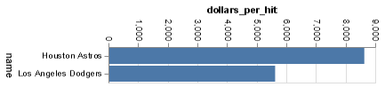

# Project Report: Finding Relationships in Baseball
#### Christian Lira Gonzalez
__Winter 2022 (Revised/Updated: Winter 2023)__
## Project Description:

Throughout this project I beging looking into SQL and how some queries can help finding certain and very specific information within a database. For the sake of fun the selected database to mess around with is going to be about Baseball and some of the math behind the sport, we will find very interesting information. So lets try these queries!

### GRAND QUESTION 1
####  I Wrote an SQL query that creates a new dataframe about baseball players who attended BYU-Idaho (my alma mater). This new table contains five columns: playerID, schoolID, salary, and the yearID/teamID associated with each salary. Orders the table by salary (highest to lowest) and prints out the table in the report.
In our first query we are asked to find baseball palyers that attended BYU-Idaho as their college (schoolid) and other information that could give us a better perspective of the sutdent/player.
So we start by calling those columns we desire that appear in our search an join some tables from where we want to extract the informatoion finally we flter the information we want, and we obtain our first table with playerid, schoolid, yearid, salary and teamid, filtering so we just obatain 10 values in our table for sake of simplification.

##### TECHNICAL DETAILS


```python 
q1 = '''
SELECT 
    p.playerid, sc.schoolid, ba.yearid,sa.salary, sa.teamid

FROM people AS p
    JOIN collegeplaying as cp On cp.playerid = p.playerid
    JOIN schools as sc ON sc.schoolid = cp.schoolid 
    JOIN batting as ba On ba.playerid = p.playerid
    JOIN teams as t ON t.teamid = ba.teamid
    JOIN salaries as sa ON sa.playerid = p.playerid
    
WHERE schools.name_full = 'Brigham Young University-Idaho'
Group by sa.yearid
ORDER BY salary DESC
LIMIT 10

''' 
dw2 = dw.query('byuidss/cse-250-baseball-database', q1).dataframe
#%%
print(dw2.to_markdown(index = False))

```
##### Query Return Table

| playerid   | schoolid   |   yearid |   salary | teamid   |
|:-----------|:-----------|---------:|---------:|:---------|
| lindsma01  | idbyuid    |     2014 |  4000000 | CHA      |
| lindsma01  | idbyuid    |     2014 |  3600000 | BAL      |
| lindsma01  | idbyuid    |     2014 |  2800000 | COL      |
| lindsma01  | idbyuid    |     2014 |  2300000 | CHA      |
| lindsma01  | idbyuid    |     2014 |  1625000 | HOU      |
| stephga01  | idbyuid    |     2003 |  1025000 | SLN      |
| stephga01  | idbyuid    |     2003 |   900000 | SLN      |
| stephga01  | idbyuid    |     2003 |   800000 | SLN      |
| stephga01  | idbyuid    |     2003 |   550000 | SLN      |
| lindsma01  | idbyuid    |     2014 |   410000 | FLO      |


### GRAND QUESTION 2
#### This three-part question requires you to calculate batting average (number of hits divided by the number of at-bats)

Second Query part 1:
 Write an SQL query that provides playerID, yearID, and batting average for players with at least one at bat. Sort the table from highest batting average to lowest, and show the top 5 results in your report.

Analysis second Query part 1:
The main purpose of this first part of the grand question 2 is to create a layout in order to answer for the following parts of the very same question. A we do this through looking for some very specific information and also creating some through some indication in the query for the creation of new values within new columns that is the example of batting average which is the combination and division of two already existing columns "ab" ("atbat") and "h" ("hits") into "hits_atbat" (the new column).

Second Query part 2:
Use the same query as above, but only include players with more than 10 “at bats” that year. Print the top 5 results.

Analysis second Query part 2:
In this second part we use our first query as a layout, but in this case we set limits for our search. Now we look for players with more than 10 at bats and we select the top 5 results.

Second Query part 3:
Now calculate the batting average for players over their entire careers (all years combined). Only include players with more than 100 at bats, and print the top 5 results.

Analysis third Query part 3:
And finally we do a more specific search of information with the very same query, instead of looking for more than 10 atbats we look for players who in their entire careers have had more than 100 atbats and we print the top 5 results.

##### TECHNICAL DETAILS


```python 
#First Query

q2 = '''
SELECT 
    p.namegiven, (b.ab) as atbat, (b.h) as hits, 
    (b.ab/b.h) as hits_atbat, b.yearid
FROM batting as b
    JOIN people as p ON p.playerid = b.playerid
    JOIN teams as t ON t.teamid = b.teamid
        AND t.yearid = b.yearid
-- WHERE b.yearid = 2000 -- 
-- HAVING atbat > 10 --
GROUP BY atbat 
ORDER BY hits_atbat DESC
LIMIT 5;
'''

dw3 = dw.query('byuidss/cse-250-baseball-database', q2).dataframe
# %%
print(dw3.to_markdown(index = False))
#%%


#Second Query:

q2_1 = '''
SELECT 
    p.namegiven, (b.ab) as atbat, (b.h) as hits, 
    (b.ab/b.h) as hits_atbat, b.yearid
FROM batting as b
    JOIN people as p ON p.playerid = b.playerid
    JOIN teams as t ON t.teamid = b.teamid
        AND t.yearid = b.yearid
 WHERE b.yearid = 2000 
HAVING atbat > 10 
ORDER BY atbat desc 
LIMIT 5
'''

dw4 = dw.query('byuidss/cse-250-baseball-database', q2_1).dataframe
#%%
print(dw4.to_markdown(index = False))
# %%


#Third Query:
q2_2 ='''
SELECT playerid, ab/h as hits_atbat,
SUM (ab) as atbat, (h) as hits
FROM batting
Where atbat > 100
GROUP BY playerid
ORDER BY atbat DESC
limit 5;
'''

# %%
dw5 = dw.query('byuidss/cse-250-baseball-database', q2_2).dataframe
#%%
print(dw5.to_markdown(index = False))
# %%
```
Query 1 Table:
Write an SQL query that provides playerID, yearID, and batting average for players with at least one at bat. Sort the table from highest batting average to lowest, and show the top 5 results in your report.
| namegiven     |   atbat |   hits |   hits_atbat |   yearid |
|:--------------|--------:|-------:|-------------:|---------:|
| Chad Robert   |      49 |      2 |         24.5 |     2016 |
| Glendon James |      17 |      1 |         17   |     2008 |
| Jorge Alberto |      48 |      3 |         16   |     2015 |
| Jorge Manuel  |      14 |      1 |         14   |     1996 |
| Pedro Julio   |      13 |      1 |         13   |     1997 |


Query 2 Table: 
Use the same query as above, but only include players with more than 10 “at bats” that year. Print the top 5 results.

| namegiven     |   atbat |   hits |   hits_atbat |   yearid |
|:--------------|--------:|-------:|-------------:|---------:|
| Darin Charles |     676 |    240 |      2.81667 |     2000 |
| Andruw Rudolf |     656 |    199 |      3.29648 |     2000 |
| Johnny David  |     655 |    214 |      3.06075 |     2000 |
| Neifi Neftali |     651 |    187 |      3.48128 |     2000 |
| Garret Joseph |     647 |    185 |      3.4973  |     2000 |


Query Table 3:
Now calculate the batting average for players over their entire careers (all years combined). Only include players with more than 100 at bats, and print the top 5 results.

| playerid   |   hits_atbat |   atbat |   hits |
|:-----------|-------------:|--------:|-------:|
| rosepe01   |      3.66471 |   14053 |    170 |
| aaronha01  |      3.57252 |   12364 |    131 |
| yastrca01  |      3.76129 |   11988 |    155 |
| ripkeca01  |      7.8     |   11551 |      5 |
| cobbty01   |      4.19444 |   11436 |     36 |

### GRAND QUESTION 3
#### Pick any two baseball teams and compare them using a metric of your choice (average salary, home runs, number of wins, etc.). Write an SQL query to get the data you need. Use Python if additional data wrangling is needed, then make a graph in Altair to visualize the comparison. Provide the visualization and its description.
To have a vey specific result and be able to create the individual charts I created a single query for the teams we are comparing and looking into: "Los Angeles Dogers" and "Houston Astros". And in this case we are just comparing the number of hitts they have had as a team and the amount of money they have as budget for every team member combined. So dividing their budget by the number of hits I created a new column called "dolars_per_hit" so we have a measure to compare the two teams and a measure of how much attraction and succes they generate through hits.
In the chart below we learn that are the "Houston Astros The ones that have less hits but they generate more through each of them compared to the "Los Angeles Dogers that have more hits but the media of each of them reduces the quantity of money they generate through each hit they make as we can observe both in the chart and in the table, tabe which also contains other useful iinformation.

##### TECHNICAL DETAILS

```python 
q3_chart= (alt.Chart(dw6).mark_bar()
  .encode(
    x = "name:O",
    y = "dollars_per_hit:Q"
))


# %%
q3_chart2= (alt.Chart(dw7).mark_bar()
  .encode(
    x = "name:Q",
    y = "dollars_per_hit:O"
))

# %%
final_chart = q3_chart + q3_chart2

```





```python 
q3 = '''
Select name, t.teamid, t.yearid, SUM (b.h) as hits,
SUM (s.salary) as budget, (s.salary/b.h) as dollars_per_hit
from teams as t
    JOIN salaries as s ON s.teamid = t.teamid 
    JOIN batting as b ON b.yearid = t.yearid
WHERE t.teamid = 'LAN'
    AND t.yearid = "2000"
GROUP BY name
'''
# %%
dw6 = dw.query('byuidss/cse-250-baseball-database', q3).dataframe
# %%
print(dw6.to_markdown(index = False))
# %%
q3_1 ='''
Select name, t.teamid, t.yearid, SUM (b.h) as hits,
SUM (s.salary) as budget,(s.salary/b.h) as dollars_per_hit
from teams as t
    JOIN salaries as s ON s.teamid = t.teamid 
    JOIN batting as b ON b.yearid = t.yearid
WHERE t.name = 'Houston Astros'
    AND t.yearid = "2000"
GROUP BY name
'''
# %%
dw7 = dw.query('byuidss/cse-250-baseball-database', q3_1).dataframe
# %%
print(dw7.to_markdown(index = False))
```
| name           | teamid   |   yearid |     hits |        budget |   dollars_per_hit |
|:---------------|:---------|---------:|---------:|--------------:|------------------:|
| Houston Astros | HOU      |     2000 | 39861726 | 2180136390888 |           8601.69 |
| Los Angeles Dodgers | LAN      |     2000 | 43300422 | 3701988362872 |           5593.22 |

## APPENDIX A (PYTHON CODE)
```python
#%%
import datadotworld as dw
import altair as alt
import numpy as np 
import pandas as pd
#%%
results = dw.query('byuidss/cse-250-baseball-database', 
    'SELECT * FROM batting LIMIT 5')

batting5 = results.dataframe
# %%

# q = '''
# SELECT b.teamid, t.name, b.yearid,
#     p.namegiven, b.ab, b.r, 
#     b.ab/b.r as runs_atbat
# FROM batting as b
#     JOIN people as p ON p.playerid = b.playerid
#     JOIN teams as t ON t.teamid = b.teamid
#         AND t.year.id = b.yearid 
# ORDER BY r DESC
# LIMIT 100
# '''

# dw.query('byuidss/cse-250-baseball-database', q).dataframe
# %%
q = '''
SELECT 
    p.namegiven, SUM (b.ab) as atbat, SUM (b.r) as runs, 
    SUM (b.ab/b.r) as runs_atbat
FROM batting as b
    JOIN people as p ON p.playerid = b.playerid
    JOIN teams as t ON t.teamid = b.teamid
        AND t.yearid = b.yearid
-- WHERE b.ab > 1000 -- 
HAVING atbat > 1000
GROUP BY b.playerid, p.namegiven
ORDER BY atbat DESC

'''

dw.query('byuidss/cse-250-baseball-database', q).dataframe

# %%
#Grand QUestion 1
#Write an SQL query to create a new dataframe about baseball players who attended BYU-Idaho. The new table should contain five columns: playerID, schoolID, salary, and the yearID/teamID associated with each salary. Order the table by salary (highest to lowest) and print out the table in your report.

q1 = '''
SELECT 
    p.playerid, sc.schoolid, ba.yearid,sa.salary, sa.teamid

FROM people AS p
    JOIN collegeplaying as cp On cp.playerid = p.playerid
    JOIN schools as sc ON sc.schoolid = cp.schoolid 
    JOIN batting as ba On ba.playerid = p.playerid
    JOIN teams as t ON t.teamid = ba.teamid
    JOIN salaries as sa ON sa.playerid = p.playerid
    
WHERE schools.name_full = 'Brigham Young University-Idaho'
Group by sa.yearid
ORDER BY salary DESC
LIMIT 10

''' 
dw2 = dw.query('byuidss/cse-250-baseball-database', q1).dataframe
#%%
print(dw2.to_markdown(index = False))

# %%

q2 = '''
SELECT 
    p.namegiven, (b.ab) as atbat, (b.h) as hits, 
    (b.ab/b.h) as hits_atbat, b.yearid
FROM batting as b
    JOIN people as p ON p.playerid = b.playerid
    JOIN teams as t ON t.teamid = b.teamid
        AND t.yearid = b.yearid
-- WHERE b.yearid = 2000 -- 
-- HAVING atbat > 10 --
GROUP BY atbat 
ORDER BY hits_atbat DESC
LIMIT 5;
'''

dw3 = dw.query('byuidss/cse-250-baseball-database', q2).dataframe
# %%
print(dw3.to_markdown(index = False))
#%%
q2_1 = '''
SELECT 
    p.namegiven, (b.ab) as atbat, (b.h) as hits, 
    (b.ab/b.h) as hits_atbat, b.yearid
FROM batting as b
    JOIN people as p ON p.playerid = b.playerid
    JOIN teams as t ON t.teamid = b.teamid
        AND t.yearid = b.yearid
 WHERE b.yearid = 2000 
HAVING atbat > 10 
ORDER BY atbat desc 
LIMIT 5
'''

dw4 = dw.query('byuidss/cse-250-baseball-database', q2_1).dataframe
#%%
print(dw4.to_markdown(index = False))
# %%
q2_2 ='''
SELECT playerid, ab/h as hits_atbat,
SUM (ab) as atbat, (h) as hits
FROM batting
GROUP BY playerid
ORDER BY atbat DESC
limit 5;
'''

# %%
dw5 = dw.query('byuidss/cse-250-baseball-database', q2_2).dataframe
#%%
print(dw5.to_markdown(index = False))
# %%
q3 = '''
Select name, t.teamid, t.yearid, SUM (b.h) as hits,
SUM (s.salary) as budget, (s.salary/b.h) as dollars_per_hit
from teams as t
    JOIN salaries as s ON s.teamid = t.teamid 
    JOIN batting as b ON b.yearid = t.yearid
WHERE t.teamid = 'LAN'
    AND t.yearid = "2000"
GROUP BY name
'''
# %%
dw6 = dw.query('byuidss/cse-250-baseball-database', q3).dataframe
# %%
print(dw6.to_markdown(index = False))
# %%
q3_1 ='''
Select name, t.teamid, t.yearid, SUM (b.h) as hits,
SUM (s.salary) as budget,(s.salary/b.h) as dollars_per_hit
from teams as t
    JOIN salaries as s ON s.teamid = t.teamid 
    JOIN batting as b ON b.yearid = t.yearid
WHERE t.name = 'Houston Astros'
    AND t.yearid = "2000"
GROUP BY name
'''
# %%
dw7 = dw.query('byuidss/cse-250-baseball-database', q3_1).dataframe
# %%
print(dw7.to_markdown(index = False))
# %%
q3_chart= (alt.Chart(dw6).mark_bar()
  .encode(
    x = "name",
    y = "dollars_per_hit"
))


# %%
q3_chart2= (alt.Chart(dw7).mark_bar()
  .encode(
    x = "name",
    y = "dollars_per_hit"
))

# %%
final_chart = q3_chart + q3_chart2
final_chart.show

```
